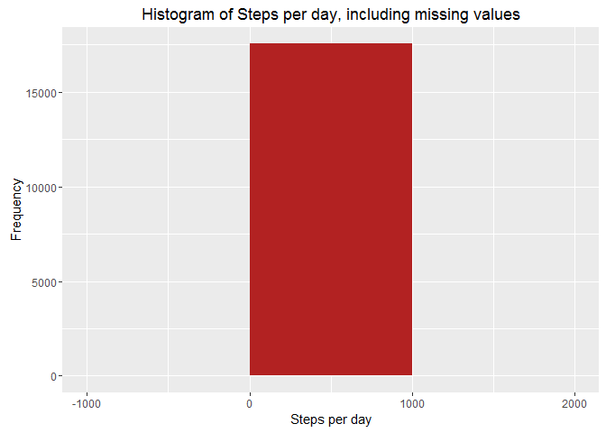

Loading and preprocessing the data
----------------------------------

    setwd("D:/Study Materials/CourseEra Videos/Reproduciable Research/HomeWork")

    filename = "RepData_PeerAssessment1.zip"
    if (!file.exists(filename)) {
      loaddata = download.file("https://d396qusza40orc.cloudfront.net/repdata%2Fdata%2Factivity.zip",
                               destfile = filename)
    }

    activity = read.csv(unz("RepData_PeerAssessment1.zip", "activity.csv"), header=T,  colClasses=c("numeric","character","numeric"))
    head(activity)

    ##   steps       date interval
    ## 1    NA 2012-10-01        0
    ## 2    NA 2012-10-01        5
    ## 3    NA 2012-10-01       10
    ## 4    NA 2012-10-01       15
    ## 5    NA 2012-10-01       20
    ## 6    NA 2012-10-01       25

    library(lattice)

What is mean total number of steps taken per day?
-------------------------------------------------

    library(lattice)
    activity$date <- as.Date(activity$date, "%Y-%m-%d")
    StepsTotal <- aggregate(steps ~ date, data = activity, sum, na.rm = TRUE)
    hist(StepsTotal$steps, main = "Total steps by day", xlab = "day", col = "red")

  

    mean(StepsTotal$steps)

    ## [1] 10766.19

    median(StepsTotal$steps)

    ## [1] 10765

What is the average daily activity pattern?
-------------------------------------------

    time_series <- tapply(activity$steps, activity$interval, mean, na.rm = TRUE)

    plot(row.names(time_series), time_series, type = "l", xlab = "5-min interval", 
        ylab = "Average across all Days", main = "Average number of steps taken", 
        col = "red")

  

    max_interval <- which.max(time_series)
    names(max_interval)

    ## [1] "835"

Imputing missing values
-----------------------

##### Question -1 : Summarize all the missing values

    activity_MissingVal <- sum(is.na(activity))
    activity_MissingVal 

    ## [1] 2304

##### Question - 2 & 3 :

##### a. Let's take the approach to fill in a missing NA with the average number of steps in the same 5-min interval.

##### b. Create a new dataset as the original and use tapply for filling in the missing values with the average number of steps per 5-minute interval:

    data_full <- activity
    nas <- is.na(data_full$steps)
    avg_interval <- tapply(data_full$steps, data_full$interval, mean, na.rm=TRUE, simplify=TRUE)
    data_full$steps[nas] <- avg_interval[as.character(data_full$interval[nas])]

##### Question - 4: Calculate the number of steps taken in each 5-minute interval per day using dplyr and group by interval. Use ggplot for making the histogram

##### check if missing values are there

    sum(is.na(data_full$steps))

    ## [1] 0

##### Calculate the number of steps taken in each 5-minute interval per day using

##### a. Create a new dataset that is equal to the original dataset but with the missing data filled in

    newData <- data_full 
    for (i in 1:nrow(newData)) {
        if (is.na(newData$steps[i])) {
            newData$steps[i] <- avgSteps[which(newData$interval[i] == avgSteps$interval), ]$meanOfSteps
        }
    }

    head(newData)

    ##       steps       date interval
    ## 1 1.7169811 2012-10-01        0
    ## 2 0.3396226 2012-10-01        5
    ## 3 0.1320755 2012-10-01       10
    ## 4 0.1509434 2012-10-01       15
    ## 5 0.0754717 2012-10-01       20
    ## 6 2.0943396 2012-10-01       25

    sum(is.na(newData))

    ## [1] 0

##### b. Make a histogram of the total number of steps taken each day and Calculate and report the mean and median total number of steps taken per day.

    library(ggplot2)
    ggplot(newData, aes( steps)) +
      geom_histogram(fill = "firebrick", binwidth = 1000) +
      labs(title = "Histogram of Steps per day, including missing values", x = "Steps per day", y = "Frequency")

  
\#\#\#\#\# Do these values differ from the estimates from the first part
of the assignment? What is the impact of imputing missing data on the
estimates of the total daily number of steps? \#\#\#\#\# Mean total
number of steps taken per day

    newTotalSteps <- aggregate(newData$steps, 
                               list(Date = newData$date), 
                               FUN = "sum")$x
    newMean <- mean(newTotalSteps)
    newMean

    ## [1] 10766.19

##### Median total number of steps taken per day

    newMedian <- median(newTotalSteps)
    newMedian

    ## [1] 10766.19

##### Compare them with the two before imputing missing data:

oldMean &lt;- mean(totalSteps) oldMedian &lt;- median(totalSteps)
newMean - oldMean newMedian - oldMedian \#\#\#\#\# So, after imputing
the missing data, the new mean of total steps taken per day is the same
as that of the old mean; the new median of total steps taken per day is
greater than that of the old median.

Are there differences in activity patterns between weekdays and weekends?
-------------------------------------------------------------------------

    day <- weekdays(activity$date)
    daylevel <- vector()
    for (i in 1:nrow(activity)) {
        if (day[i] == "Saturday") {
            daylevel[i] <- "Weekend"
        } else if (day[i] == "Sunday") {
            daylevel[i] <- "Weekend"
        } else {
            daylevel[i] <- "Weekday"
        }
    }

    head(activity)

    ##   steps       date interval
    ## 1    NA 2012-10-01        0
    ## 2    NA 2012-10-01        5
    ## 3    NA 2012-10-01       10
    ## 4    NA 2012-10-01       15
    ## 5    NA 2012-10-01       20
    ## 6    NA 2012-10-01       25

    activity$daylevel <- daylevel
    activity$daylevel <- factor(activity$daylevel)

    stepsByDay <- aggregate(steps ~ interval + daylevel, data = activity, mean)
    names(stepsByDay) <- c("interval", "daylevel", "steps")

    xyplot(steps ~ interval | daylevel, stepsByDay, type = "l", layout = c(1, 2), 
        xlab = "Interval", ylab = "Number of steps")

