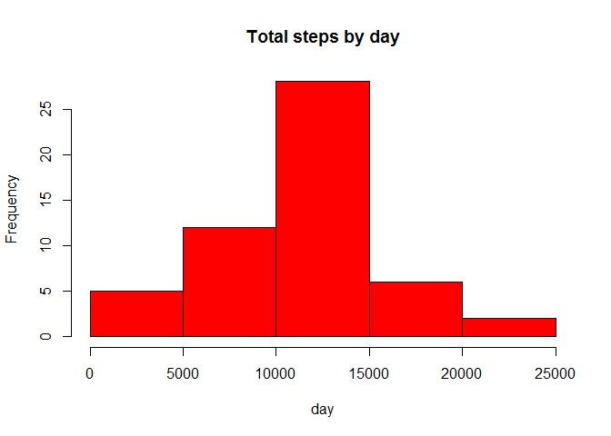

Loading and preprocessing the data
----------------------------------

    setwd("D:/Study Materials/CourseEra Videos/Reproduciable Research/HomeWork")

    filename = "RepData_PeerAssessment1.zip"
    if (!file.exists(filename)) {
      loaddata = download.file("https://d396qusza40orc.cloudfront.net/repdata%2Fdata%2Factivity.zip",
                               destfile = filename)
    }

    activity = read.csv(unz("RepData_PeerAssessment1.zip", "activity.csv"), header=T,  colClasses=c("numeric","character","numeric"))
    head(activity)

    ##   steps       date interval
    ## 1    NA 2012-10-01        0
    ## 2    NA 2012-10-01        5
    ## 3    NA 2012-10-01       10
    ## 4    NA 2012-10-01       15
    ## 5    NA 2012-10-01       20
    ## 6    NA 2012-10-01       25

    library(lattice)

What is mean total number of steps taken per day?
-------------------------------------------------

    library(lattice)
    activity$date <- as.Date(activity$date, "%Y-%m-%d")
    StepsTotal <- aggregate(steps ~ date, data = activity, sum, na.rm = TRUE)
    hist(StepsTotal$steps, main = "Total steps by day", xlab = "day", col = "red")

  

    mean(StepsTotal$steps)

    ## [1] 10766.19

    median(StepsTotal$steps)

    ## [1] 10765

What is the average daily activity pattern?
-------------------------------------------

    time_series <- tapply(activity$steps, activity$interval, mean, na.rm = TRUE)

    plot(row.names(time_series), time_series, type = "l", xlab = "5-min interval", 
        ylab = "Average across all Days", main = "Average number of steps taken", 
        col = "red")

  

    max_interval <- which.max(time_series)
    names(max_interval)

    ## [1] "835"

Imputing missing values
-----------------------

    activity_MissingVal <- sum(is.na(activity))
    activity_MissingVal 

    ## [1] 2304

Are there differences in activity patterns between weekdays and weekends?
-------------------------------------------------------------------------

    day <- weekdays(activity$date)
    daylevel <- vector()
    for (i in 1:nrow(activity)) {
        if (day[i] == "Saturday") {
            daylevel[i] <- "Weekend"
        } else if (day[i] == "Sunday") {
            daylevel[i] <- "Weekend"
        } else {
            daylevel[i] <- "Weekday"
        }
    }

    head(activity)

    ##   steps       date interval
    ## 1    NA 2012-10-01        0
    ## 2    NA 2012-10-01        5
    ## 3    NA 2012-10-01       10
    ## 4    NA 2012-10-01       15
    ## 5    NA 2012-10-01       20
    ## 6    NA 2012-10-01       25

    activity$daylevel <- daylevel
    activity$daylevel <- factor(activity$daylevel)

    stepsByDay <- aggregate(steps ~ interval + daylevel, data = activity, mean)
    names(stepsByDay) <- c("interval", "daylevel", "steps")

    xyplot(steps ~ interval | daylevel, stepsByDay, type = "l", layout = c(1, 2), 
        xlab = "Interval", ylab = "Number of steps")

